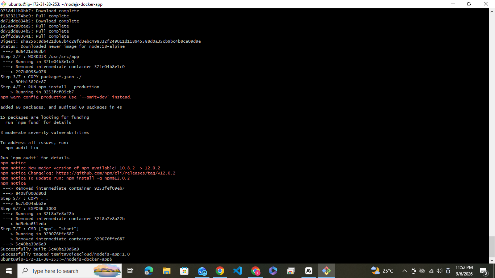
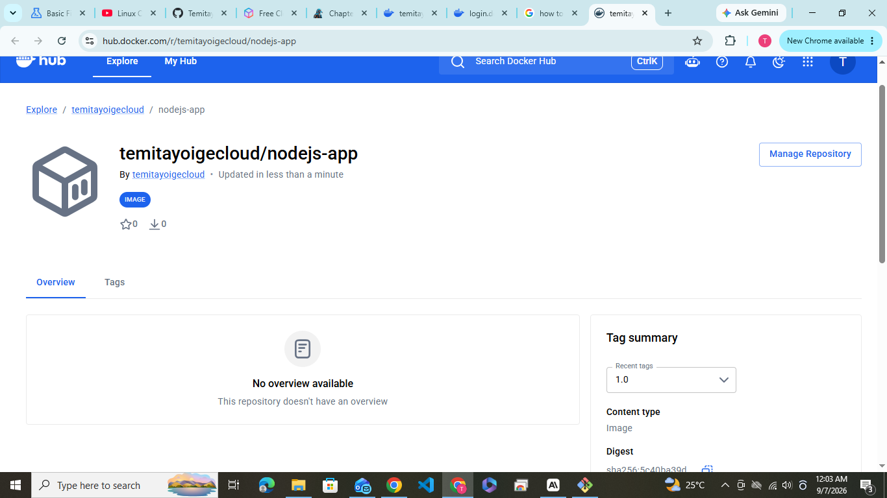
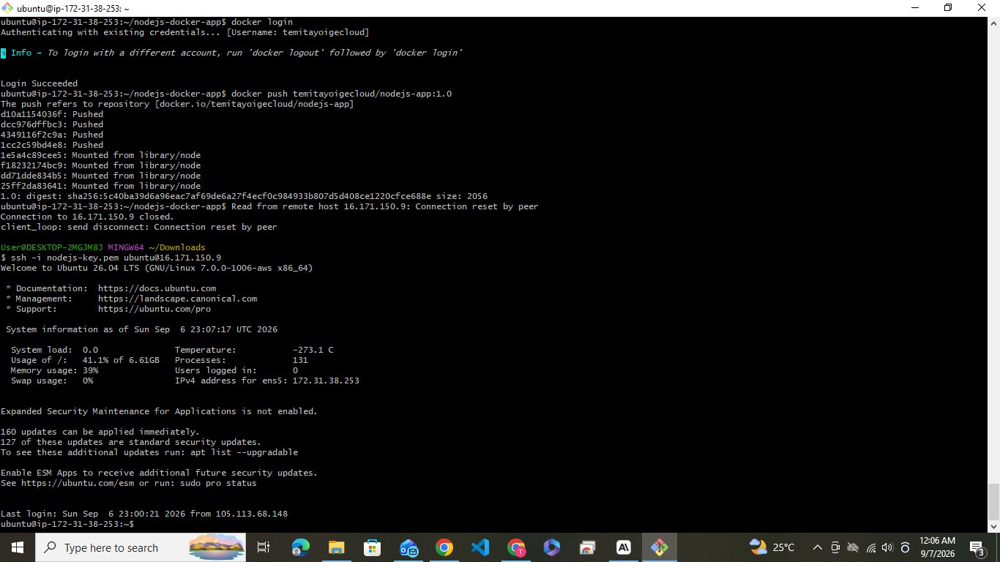
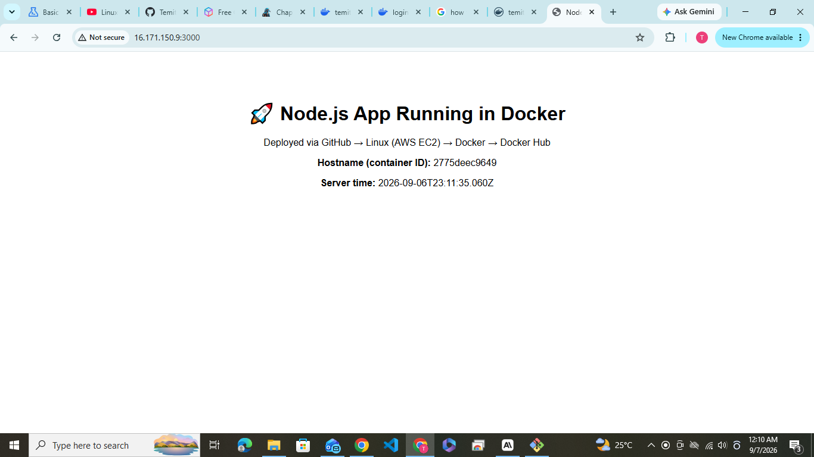

# Node.js & Docker Deployment on AWS

A simple Node.js (Express) application built, containerized with Docker, pushed to
Docker Hub, and deployed on an AWS EC2 (Linux) instance.

## Stack
- Node.js + Express
- Docker
- Docker Hub
- AWS EC2 (Ubuntu)
- GitHub

## App Endpoints
- `GET /` — HTML page confirming the app is running (shows container hostname + server time)
- `GET /health` — JSON health check

## Files
- `app.js` — the Express application
- `package.json` — dependencies and start script
- `Dockerfile` — container build instructions
- `.dockerignore` — files excluded from the image build

## Run locally (no Docker)
```bash
npm install
npm start
# visit http://localhost:3000
```

## Run with Docker (local)
```bash
docker build -t YOUR_DOCKERHUB_USERNAME/nodejs-app:1.0 .
docker run -d -p 3000:3000 YOUR_DOCKERHUB_USERNAME/nodejs-app:1.0
```

## Full Deployment Walkthrough (GitHub → AWS EC2 → Docker Hub)

### 1. Push this app to GitHub
```bash
git init
git add .
git commit -m "Initial commit: Node.js app with Dockerfile"
git branch -M main
git remote add origin https://github.com/YOUR_GITHUB_USERNAME/nodejs-docker-app.git
git push -u origin main
```

### 2. Launch an AWS EC2 instance
- AWS Console → EC2 → Launch Instance
- AMI: **Ubuntu Server 22.04 LTS**
- Instance type: `t2.micro` (free tier eligible)
- Key pair: create/download a `.pem` key
- Security group inbound rules:
  - SSH (22) — your IP
  - Custom TCP (3000) — 0.0.0.0/0 (so you can view the live app in a browser)

### 3. Connect to the instance
```bash
chmod 400 your-key.pem
ssh -i your-key.pem ubuntu@YOUR_EC2_PUBLIC_IP
```

### 4. Install Git and Docker on the instance
```bash
sudo apt update
sudo apt install -y git docker.io
sudo systemctl enable docker
sudo systemctl start docker
sudo usermod -aG docker $USER
# log out and back in (or run `newgrp docker`) so docker works without sudo
```

### 5. Clone your repo
```bash
git clone https://github.com/YOUR_GITHUB_USERNAME/nodejs-docker-app.git
cd nodejs-docker-app
ls   # confirm app.js, package.json, Dockerfile are present
```

### 6. Build the Docker image
```bash
docker build -t YOUR_DOCKERHUB_USERNAME/nodejs-app:1.0 .
```
📸 **Screenshot 1 — Docker Build:** capture the terminal output of this command,
including the final "Successfully tagged" / build-complete line.

### 7. Push the image to Docker Hub
```bash
docker login
docker push YOUR_DOCKERHUB_USERNAME/nodejs-app:1.0
```
📸 **Screenshot 2 — Docker Hub:** log into hub.docker.com, open your repository,
and screenshot the `nodejs-app` repo showing the `1.0` tag.

### 8. Pull and run the image
```bash
docker pull YOUR_DOCKERHUB_USERNAME/nodejs-app:1.0
docker run -d -p 3000:3000 --name nodejs-app YOUR_DOCKERHUB_USERNAME/nodejs-app:1.0
docker ps
```
📸 **Screenshot 3 — Running Container:** capture `docker ps` showing the
`nodejs-app` container with status `Up` and port `3000->3000`.

### 9. View the live app
In your browser, go to:
```
http://YOUR_EC2_PUBLIC_IP:3000
```
📸 **Screenshot 4 — Live Application:** capture the browser showing the app's
homepage.

---

## Screenshots

| Step | Screenshot |
|------|------------|
| Docker Build |  |
| Docker Hub Repository |  |
| Running Container (`docker ps`) |  |
| Live Application |  |


